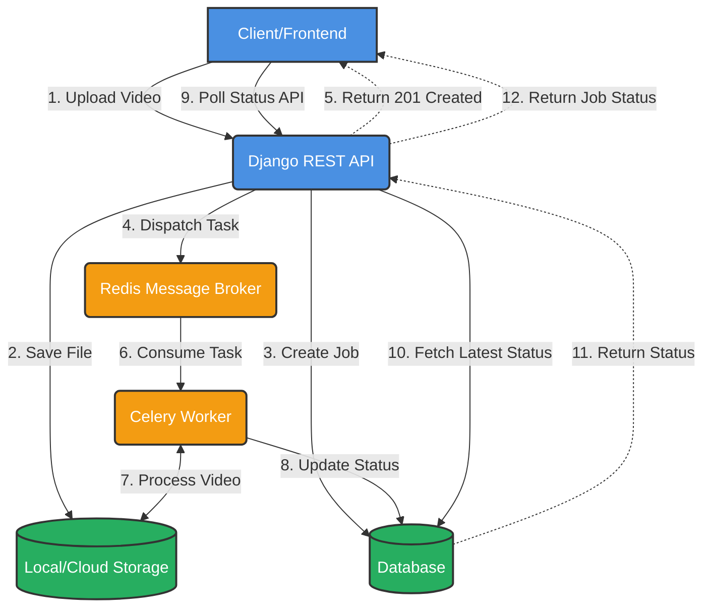

<div align="center">
  
  
  
  
  <h1>🚀 Video Processing Pipeline</h1>
  <p>A high-performance, asynchronous video processing backend built with Django REST Framework and Celery.</p>
</div>

---

## 🌟 Overview
This project provides a robust backend architecture for uploading and processing videos asynchronously. By leveraging **Celery** for background task execution and **Redis** as a message broker, the pipeline ensures the main thread is never blocked, allowing for scalable and efficient handling of resource-intensive media processing.

## 🏗️ Architecture



## ✨ Key Features
- **Asynchronous Processing**: Prevents API blocking during heavy video encoding/processing.
- **RESTful API**: Clean and standardized endpoints using Django REST Framework.
- **Job Tracking**: Real-time status polling (PENDING, PROCESSING, COMPLETED).
- **Scalable Architecture**: Easily scale Celery workers to handle higher processing loads.

## 🧰 Tech Stack
- **Backend Framework**: Django & Django REST Framework (DRF)
- **Task Queue**: Celery
- **Message Broker / Cache**: Redis
- **Database**: SQLite (Default) / PostgreSQL (Production-ready)

## 🚀 Getting Started

### Prerequisites
- Python 3.8+
- Redis Server (running on `localhost:6379`)

### Installation & Setup

1. **Clone the repository** (or navigate to the project directory):
   ```bash
   cd Video_Processing_Pipeline/config
   ```

2. **Create and activate a virtual environment**:
   ```bash
   python -m venv venv
   source venv/bin/activate  # On Windows: venv\Scripts\activate
   ```

3. **Install dependencies**:
   ```bash
   pip install -r requirements.txt
   ```
   *(Note: Ensure `django`, `djangorestframework`, `celery`, and `redis` are installed)*

4. **Run Database Migrations**:
   ```bash
   python manage.py makemigrations
   python manage.py migrate
   ```

5. **Start the Redis Server**:
   Make sure Redis is installed and running on your system.

6. **Start the Celery Worker**:
   Open a new terminal, activate the virtual environment, and run:
   ```bash
   celery -A config worker -l info --pool=solo
   ```
   *(Use `--pool=solo` on Windows to avoid process spawning issues)*

7. **Start the Django Development Server**:
   ```bash
   python manage.py runserver
   ```

## 📡 API Endpoints

### 1. Upload a Video
Upload a video file to initiate the processing pipeline.
- **Endpoint**: `POST /api/core/upload/`
- **Payload**: `multipart/form-data` with a `video` file and `name` field.
- **Response**: Returns the uploaded video details and triggers a background job.

### 2. List All Processing Jobs
Retrieve a list of all processing jobs and their current statuses.
- **Endpoint**: `GET /api/workers/jobs/`
- **Response**: Array of jobs (Status: `PENDING`, `PROCESSING`, or `COMPLETED`).

### 3. Check Specific Job Status
Poll this endpoint to check the progress of a specific video processing job.
- **Endpoint**: `GET /api/workers/jobs/<id>/`
- **Response**: Details of the specific job including the current status.

## 🔮 Future Enhancements
- [ ] Add WebSockets for real-time status updates (instead of polling).
- [ ] Integrate AWS S3 for scalable cloud video storage.
- [ ] Implement actual video compression and format conversion using `FFmpeg`.
- [ ] Add comprehensive Unit and Integration tests.

---
<div align="center">
  <i>Built with ❤️ for scalable media processing</i>
</div>
